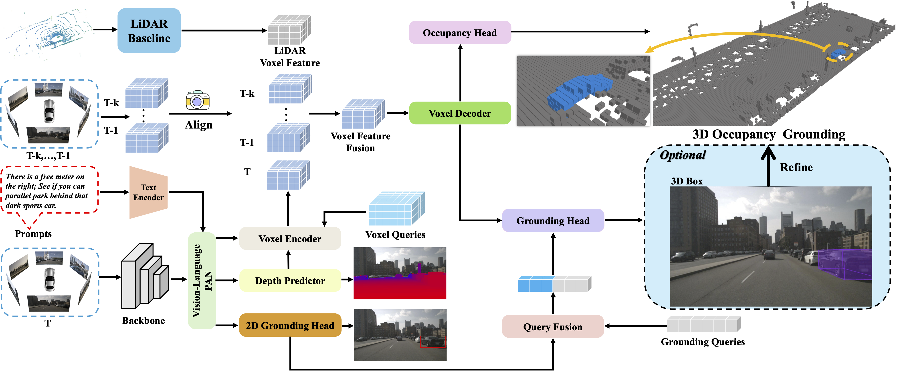

# GroundingOcc
> Zhan Shi, Song Wang, Junbo Chen, Jianke Zhu

This is the official implementation of **A Coarse to Fine Approach to Multi-Modality 3D Occupancy Grounding** (IROS 2025).

## Abstract
Visual grounding aims to identify objects or regions in a scene based on natural language descriptions, which is essential for spatially aware perception in autonomous driving. However, existing visual grounding tasks typically depend on bounding boxes that often fail to capture fine-grained details. 
Not all voxels within a bounding box are occupied, resulting in inaccurate object representations.
To address this issue, we introduce a new benchmark for 3D occupancy grounding in challenging outdoor scenes. 
Built on the nuScenes dataset, it integrates natural language descriptions with voxel-level occupancy annotations, offering more precise object perception compared to traditional grounding methods.
Moreover, we propose GroundingOcc, an end-to-end model designed for 3D occupancy grounding through multimodal learning. It combines visual, textual, and point cloud features to predict object location and occupancy information from coarse to fine. 
Specifically, GroundingOcc comprises a multimodal encoder for feature extraction, an occupancy head for voxel-wise predictions, and a grounding head to refine localization. 
Additionally, a 2D grounding module and a depth estimation module enhance geometric understanding, thereby boosting model performance.
Extensive experiments on the benchmark demonstrate that our method outperforms existing baselines on 3D occupancy grounding.

  

## Talk2Occ Dataset
Coming soon~

## Acknowledgement
We gratefully acknowledge the contributions of various open-source projects that supported this work:
[Occ3D](https://github.com/Tsinghua-MARS-Lab/Occ3D), [Talk2Car](https://github.com/talk2car/Talk2Car).
